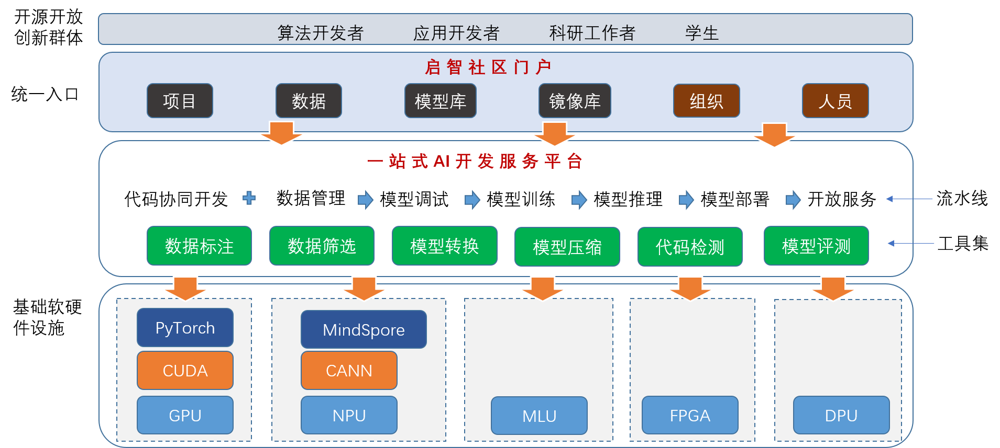

<!--[English](README_EN.md)-->

<h1>AiForge - 启智AI开发协作平台</h1>

[](https://openi.pcl.ac.cn/OpenI/aiforge/releases/latest)
[](https://opensource.org/licenses/MIT)

## AiForge

启智AI开发协作平台是一个在线Web应用，旨在为人工智能算法、模型开发提供在线协同工作环境，它提供了<b>代码托管、数据集管理与共享、免费云端算力资源支持(GPU/NPU)、共享镜像</b>等功能。

[启智AI开发协作平台](https://openi.pcl.ac.cn) 是使用本项目构建的在线服务，您可以直接点击链接访问试用。

本项目是基于[Gitea](https://github.com/go-gitea/gitea)发展而来的，我们对其进行了Fork并基于此扩展了人工智能开发中需要的功能，如数据集管理和模型训练等。对于和代码托管相关的功能，您可以参考[Gitea的文档](https://docs.gitea.io/zh-cn/)。

### 系统总体架构

下图展示了系统总体架构，本项目分为Web前端和服务后端，Web页面面向算法开发者、应用开发者、科研工作者、学生等用户群体，通过统一的Web页面入口，使用系统提供的系统服务。

后端服务涵盖了AI模型开发流水线，包括代码协同开发、数据管理、模型调试、训练、推理和部署等（*目前尚未支持模型部署*）。在不同的开发阶段，我们还将提供丰富的开发工具供用户使用，如数据标注、数据筛选、模型转换、模型压缩、代码检测等。我们也欢迎社区提供更多丰富的工具接入，提高利用平台进行开发的效率。


## 在线服务使用

本项目的在线服务平台的详细使用帮助文档，可参阅本项目[百科](https://openi.pcl.ac.cn/OpenI/aiforge/wiki)内容。

- 如何创建账号

- 如何创建组织及管理成员权限

- 如何创建项目仓库

- 如何使用数据集功能

- 如何使用计算资源进行模型调试和训练

- 使用小技巧

- 常见问题(FAQ)
  
  ## 安装
  
  您也可以基于本项目代码，在本地环境安装部署服务。
  
  ### 数据库准备
  
  [数据库准备说明](https://docs.gitea.io/zh-cn/database-prep/)
  
  ### 从源代码安装

- node版本 >= v10.13.0

- golang版本 >= 1.18.10

[从源代码安装说明](https://docs.gitea.io/zh-cn/install-from-source/)

## 开发者指南

#### Linux下通过Docker快速搭建开发环境：

前提条件：已安装Docker，了解Docker的基本操作；熟悉git的基本操作（拉取代码，提交代码，合并代码，创建分支）。

1. 拉取镜像：
   
   aiforge-postgres是数据库镜像，初始化了数据库；
   
   aiforge-dev是开发环境镜像，安装了go,nodejs,openssh等依赖。
   
   如果执行命令提示没有权限，在命令前加sudo
   
   ```
   docker pull swr.cn-north-4.myhuaweicloud.com/openi/aiforge-postgres:v1
   
   docker pull swr.cn-north-4.myhuaweicloud.com/openi/aiforge-dev:v2
   ```

2. 启动镜像：
   
   注意：由于linux下的回车符和windows不一致，直接拷贝命令执行可能失败。 如果失败：去掉'\\'，把命令改成一行命令再执行。
   
   ```
   docker run --name postgres-openi \
        -e POSTGRES_PASSWORD=openi \
        -e PGDATA=/var/lib/postgresql/data/pgdata \
        -p 5432:5432 \
        -v /home/openi/postgresql/data:/var/lib/postgresql/data \
        -d swr.cn-north-4.myhuaweicloud.com/openi/aiforge-postgres:v1
   ```
   
   ```
   docker run --name aiforgedev \
        -p 8787:3000 \
        -p 2222:22 \
        -v /home/openi/data:/data \
        -d swr.cn-north-4.myhuaweicloud.com/openi/aiforge-dev:v2
   ```

3. 进入开发容器并下载代码：
   
   - 执行sudo docker ps，找到名称为aiforgedev的容器id(CONTAINER ID )
   
   - 执行docker exec -it {开发容器id} /bin/bash
   
   - 执行cd /data
   
   - 执行git clone  {aiforge项目地址或派生项目地址，例如https://openi.pcl.ac.cn/OpenI/aiforge.git,后续说明已此地址为例}

4. 设置配置文件：
   
   - 在/data/aiforge/custom/conf目录下创建app.ini
   
   - 文件内容如下:
     
     注意：需要将文件中的两个Local_IP替换为本机IP地址
     
     > APP_NAME = aiforge
     > RUN_MODE = prod
     > 
     > [repository]
     > ROOT = /data/git/repositories
     > 
     > [repository.local]
     > LOCAL_COPY_PATH = /data/gitea/tmp/local-repo
     > 
     > [repository.upload]
     > TEMP_PATH = /data/gitea/uploads
     > 
     > [server]
     > SSH_DOMAIN       = 0.0.0.0
     > DOMAIN           = 0.0.0.0
     > HTTP_PORT        = 3000
     > ROOT_URL         = http://0.0.0.0:3000
     > DISABLE_SSH      = false
     > SSH_PORT         = 22
     > LFS_START_SERVER = true
     > LFS_CONTENT_PATH = /data/git/lfs
     > LFS_JWT_SECRET   = tqVLRkZYpP4UlAoZtZcdX2paFZ6G7FN_Y47It6PfJAE
     > OFFLINE_MODE     = false
     > 
     > [database]
     > DB_TYPE  = postgres
     > HOST     = Local_IP:5432
     > NAME     = gitea
     > USER     = gitea
     > PASSWD   = gitea
     > SCHEMA   =
     > SSL_MODE = disable
     > CHARSET  = utf8
     > PATH    = /data/gitea/gitea.db
     > 
     > [database_statistic]
     > DB_TYPE  = postgres
     > HOST     = Local_IP:5432
     > NAME     = statistic
     > USER     = gitea
     > PASSWD   = gitea
     > SCHEMA   =
     > SSL_MODE = disable
     > CHARSET  = utf8
     > PATH     = /data/gitea/statistic.db
     > 
     > [indexer]
     > ISSUE_INDEXER_PATH = /data/gitea/indexers/issues.bleve
     > 
     > [session]
     > PROVIDER_CONFIG = /data/gitea/sessions
     > 
     > [picture]
     > AVATAR_UPLOAD_PATH = /data/gitea/avatars
     > REPOSITORY_AVATAR_UPLOAD_PATH = /data/gitea/repo-avatars
     > 
     > [attachment]
     > PATH = /data/gitea/attachments
     > 
     > ENABLED = true
     > MAX_SIZE = 1048576
     > ALLOWED_TYPES = */*
     > MAX_FILES = 10
     > STORE_TYPE = minio
     > MINIO_ENDPOINT = 
     > 
     > MINIO_ACCESS_KEY_ID = 
     > MINIO_SECRET_ACCESS_KEY = 
     > MINIO_BUCKET = 
     > MINIO_LOCATION = 
     > MINIO_BASE_PATH = attachment/
     > MINIO_USE_SSL = true
     > MINIO_REAL_PATH = 
     > 
     > [log]
     > MODE      = file
     > LEVEL     = info
     > ROOT_PATH = /data/gitea/log
     > 
     > [security]
     > INSTALL_LOCK = true
     > SECRET_KEY   = sdfsagg453535
     > 
     > [service]
     > DISABLE_REGISTRATION = false
     > REQUIRE_SIGNIN_VIEW  = false
     > 
     > [obs]
     > 
     > ENDPOINT = 
     > 
     > ACCESS_KEY_ID = 
     > SECRET_ACCESS_KEY = 
     > BUCKET = 
     > LOCATION = 
     > BASE_PATH = 
     > CODE_PATH_PREFIX = 
     > Output_Path = 
     > TrainJobModel_Path = 
     > 
     > [picture]
     > DISABLE_GRAVATAR        = true
     > ENABLE_FEDERATED_AVATAR = false

5. 编译:
   
   ```
   cd /data/aiforge
   make build
   ```

6. 运行：
   
   ```
   ./opendata web
   ```

7. 访问：http://本机ip:8787
   
   注意：代码提交到aiforge请参考[代码提交](https://openi.pcl.ac.cn/docs/index.html#/repo/code.md)，[合并请求](https://openi.pcl.ac.cn/docs/index.html#/repo/pr?id=%e5%90%88%e5%b9%b6%e8%af%b7%e6%b1%82)
   
   **特别说明：** 目前无法给开发者提供云脑和智算网络的开发环境，开发者暂时只能参与代码管理相关的任务开发。

## 授权许可

本项目采用 MIT 开源授权许可证，完整的授权说明已放置在 [LICENSE](https://openi.pcl.ac.cn/OpenI/aiforge/src/branch/develop/LICENSE) 文件中。

## 需要帮助?

如果您在使用或者开发过程中遇到问题，可以在以下渠道咨询：

- 点击[这里](https://openi.pcl.ac.cn/OpenI/aiforge/issues)在线提交问题（点击页面右上角绿色按钮**创建任务**）

- 加入微信群实时交流，获得进一步的支持
  
  

## 启智社区小白训练营：

- 结合案例给大家详细讲解如何使用社区平台，帮助无技术背景的小白成长为启智社区达人 (https://openi.pcl.ac.cn/zeizei/OpenI_Learning)

## 平台引用

如果本平台对您的科研工作提供了帮助，可在论文致谢中加入：
英文版：```Thanks for the support provided by OpenI Community (https://openi.pcl.ac.cn).```
中文版：```感谢启智社区提供的技术支持(https://openi.pcl.ac.cn)。```

如果您的成果中引用了本平台，也欢迎在下述开源项目中提交您的成果信息：
https://openi.pcl.ac.cn/OpenIOSSG/references
